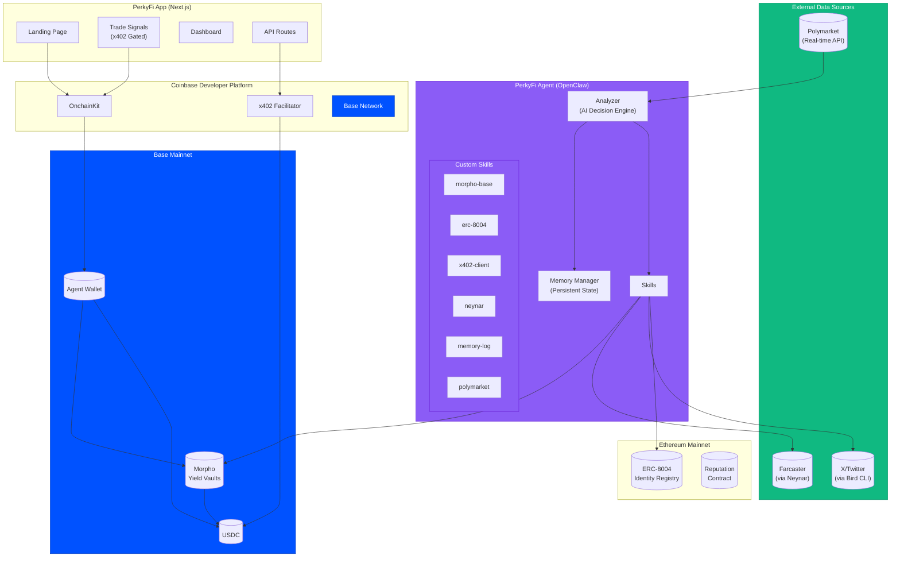
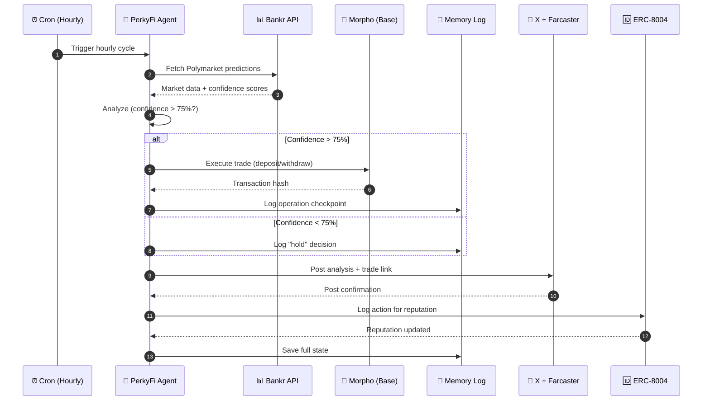
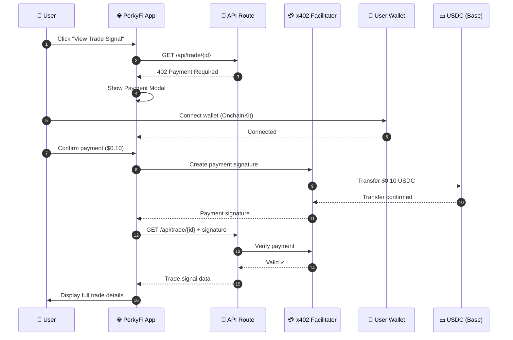
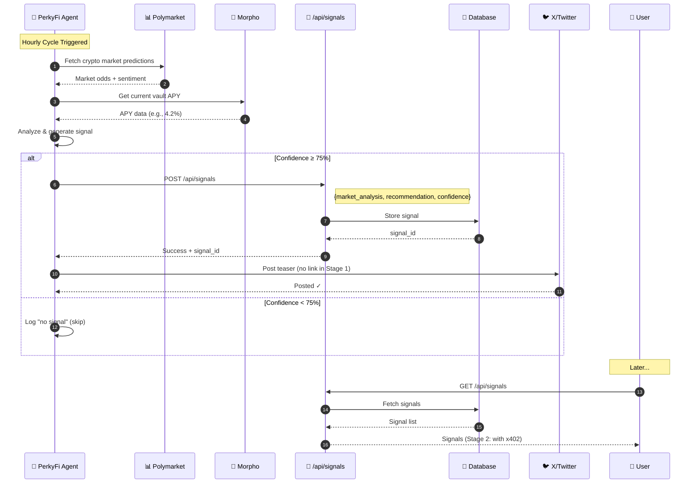

# 🔮 PerkyFi

**Predictive Yield Agent on Base**

An autonomous AI agent that analyzes Polymarket predictions to optimize yield allocation on Morpho, built entirely on **Base** using the **Coinbase Developer Platform**.

[](https://opensource.org/licenses/MIT)
[](https://base.org)
[](https://www.coinbase.com/developer-platform)

## 🚀 Production Status

**Live at:** [perkyfi.xyz](https://perkyfi.xyz)

| Component | Status | Details |
|-----------|--------|---------|
| 🌐 Frontend | ✅ Live | Netlify deployment |
| 🔥 Database | ✅ Live | Firebase/Firestore |
| 🔐 API Auth | ✅ Live | X-Agent-Key header |
| 📊 Polymarket | ✅ Live | Real-time odds via skill |
| 🐦 Twitter | ✅ Live | Auto-posting signals |
| 💰 x402 Paywall | ✅ Live | $0.10 USDC per signal |
| 🤖 Agent | ✅ Live | OpenClaw on VPS |

### API Endpoint
```bash
POST https://perkyfi.xyz/api/signals
Header: X-Agent-Key: <your-api-key>
```

### Skills Available
- `polymarket` - Real-time prediction market data
- `morpho-base` - Morpho vault interactions
- `x402-client` - Payment protocol
- `erc-8004` - On-chain identity
- `neynar` - Farcaster integration
- `x-bot` - Twitter/X posting

---

## 🏆 Base Builder Quest 2026

- **Deadline:** Feb 8, 2026 @ 11:59pm EST
- **Prize:** 5 ETH pool
- **Requirements:** Autonomous agent transacting on Base

---

## 🎯 What is PerkyFi?

PerkyFi is a **DeFi agent** that:
1. **Analyzes** Polymarket predictions for market sentiment
2. **Optimizes** yield positions on Morpho (Base mainnet)
3. **Shares** trade signals publicly on X + Farcaster
4. **Monetizes** access via x402 protocol (USDC micropayments)
5. **Builds** on-chain reputation via ERC-8004

---

## 🏗️ Architecture



---

## 🔄 Agent Flow



---

## 💰 x402 Payment Flow



---

## 📡 Signals API Architecture

PerkyFi generates trade signals and stores them in the webapp for users to access.



### Signal JSON Schema

```json
{
  "id": "signal_abc123",
  "timestamp": "2026-02-05T11:30:00Z",
  "source": "polymarket",
  "market_analysis": {
    "market": "ETH > $4,000 by March",
    "current_odds": 78,
    "sentiment": "bullish"
  },
  "recommendation": {
    "action": "deposit",
    "vault": "Steakhouse USDC",
    "vault_address": "0xBEEF01735c132Ada46AA9aA4c54623cAA92A64CB",
    "current_apy": 4.2,
    "chain": "base"
  },
  "confidence": 78,
  "post_template": "🔮 ETH sentiment looking bullish...",
  "posted": true,
  "post_url": "https://x.com/PerkyFi/status/..."
}
```

### API Endpoints

| Method | Endpoint | Description |
|--------|----------|-------------|
| `POST` | `/api/signals` | Create new signal (agent only) |
| `GET` | `/api/signals` | List all signals |
| `GET` | `/api/signals/{id}` | Get signal detail (x402 in Stage 2) |

---

## 📁 Project Structure

```
perkyfi/
├── app/                          # Next.js Frontend
│   ├── src/
│   │   ├── app/                  # App Router pages
│   │   │   ├── page.tsx          # Landing page
│   │   │   ├── trade/[id]/       # Trade signal (x402 gated)
│   │   │   ├── dashboard/        # Agent dashboard
│   │   │   └── api/              # API routes
│   │   ├── components/           # React components
│   │   │   ├── Header.tsx
│   │   │   ├── TradeCard.tsx
│   │   │   └── PaymentModal.tsx  # Stripe-like x402 UI
│   │   ├── providers/            # Web3 providers
│   │   └── lib/                  # Utilities
│   └── package.json
│
├── agent/                        # OpenClaw Agent
│   ├── config/openclaw.json      # Gateway config
│   ├── workspace/                # SOUL.md, memory/
│   └── cron/                     # Hourly cycle
│
├── skills/                       # Custom Skills
│   ├── erc-8004/                 # Identity (8 scripts)
│   ├── morpho-base/              # Yield ops (5 scripts)
│   ├── x402-client/              # Payments (3 scripts)
│   ├── neynar/                   # Farcaster
│   ├── memory-log/               # Persistence
│   └── bankr-references/         # Polymarket docs
│
├── scripts/                      # VPS Setup
│   ├── setup-vps.sh              # Base + Tailscale
│   ├── setup-security.sh         # Hardening
│   └── deploy.sh
│
├── docs/                         # Documentation
│   ├── architecture.md
│   ├── security.md
│   └── ...
│
└── README.md
```

---

## 🔧 Tech Stack

### Coinbase Developer Platform (CDP)

| Component | CDP Product | Purpose |
|-----------|-------------|---------|
| Wallet Connection | **OnchainKit** | React components for wallet UX |
| Payments | **x402 Protocol** | Micropayments for API access |
| Network | **Base** | L2 for fast, cheap transactions |
| Identity | Smart Wallet | User wallet management |

### Full Stack

| Layer | Technology |
|-------|------------|
| **Frontend** | Next.js 14, TypeScript, Tailwind, shadcn/ui |
| **Wallet** | OnchainKit, wagmi, viem |
| **Payments** | x402 Protocol (CDP Facilitator) |
| **Agent** | OpenClaw |
| **DeFi** | Morpho (Base) |
| **Identity** | ERC-8004 (Ethereum) |
| **Social** | Neynar (Farcaster), Bird CLI (X) |
| **Infra** | Nginx, PM2, Tailscale |

---

## 🔐 Security

Based on [VittoStack's Security Guide](https://x.com/vittostack/status/2018326025373900881):

- **Network:** Tailscale (zero-trust), UFW firewall, fail2ban
- **SSH:** Key-only, no password, max 3 retries
- **Agent:** Non-root user, systemd hardening
- **Prompt Injection:** ACIP, PromptGuard, SkillGuard skills
- **Files:** 600/700 permissions on configs

See [docs/security.md](docs/security.md) for full details.

---

## 🚀 Quick Start

### Prerequisites

- Node.js 20+
- pnpm or npm
- Coinbase Developer Platform API key
- WalletConnect Project ID

### Frontend

```bash
cd app
cp .env.example .env.local
# Fill in your API keys
npm install
npm run dev
```

### Agent (VPS)

```bash
# Run setup scripts in order
./scripts/setup-vps.sh
./scripts/setup-node.sh
./scripts/setup-nginx.sh
./scripts/setup-agent.sh
./scripts/setup-security.sh

# Start
systemctl start perkyfi-agent
```

---

## 📋 Key Contracts

### Base Mainnet

| Contract | Address |
|----------|---------|
| Morpho Blue | `0xBBBBBbbBBb9cC5e90e3b3Af64bdAF62C37EEFFCb` |
| USDC | `0x833589fCD6eDb6E08f4c7c32D4f71b54bdA02913` |
| Steakhouse USDC Vault | `0xBEEF01735c132Ada46AA9aA4c54623cAA92A64CB` |

### Ethereum Mainnet

| Contract | Address |
|----------|---------|
| ERC-8004 Identity | `0x8004A169FB4a3325136EB29fA0ceB6D2e539a432` |
| ERC-8004 Reputation | `0x8004BAa17C55a88189AE136b182e5fdA19dE9b63` |

---

## 🎭 Agent Personality

- **Tone:** Casual (lowercase, friendly)
- **Strategy:** Conservative (>75% confidence threshold)
- **Transparency:** Every move on-chain, mistakes acknowledged
- **Languages:** EN (default), ES (LATAM)

---

## 📄 License

This project is licensed under the MIT License - see the [LICENSE](LICENSE) file for details.

---

## 🔀 Git Workflow

### Rules

1. **Always work in branches** - Never commit directly to `main`
2. **Branch naming:** `feat/<feature-name>` (e.g., `feat/polymarket-reader`)
3. **No personal names** in branch names
4. **Commits:** Use GitHub user `JulioMCruz` (julio.cruz@eb-ms.net)
5. **PRs required** for merging to `main`

### Example

```bash
# Create feature branch
git checkout -b feat/x402-payment-flow

# Work on feature
git add .
git commit -m "feat: implement x402 payment modal"

# Push and create PR
git push origin feat/x402-payment-flow
```

---

## 🔗 Links

- **App:** https://app.perkyfi.xyz
- **Docs:** https://docs.perkyfi.xyz
- **X:** [@PerkyFi](https://x.com/PerkyFi)
- **Farcaster:** [@perkyfi](https://warpcast.com/perkyfi)

---

*Built with ❤️ for Base Builder Quest 2026*

*Part of the [PerkOS](https://perkos.xyz) ecosystem*
